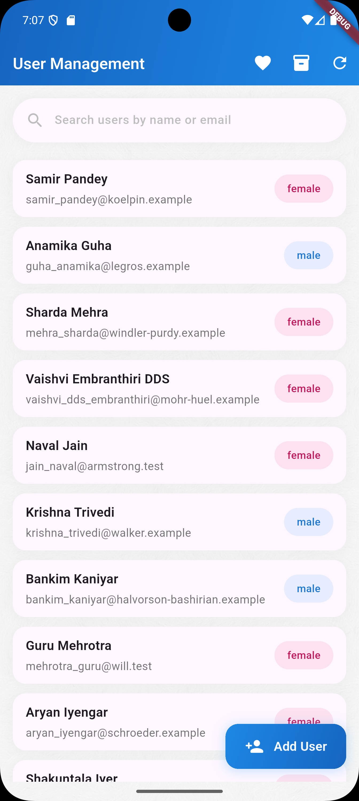
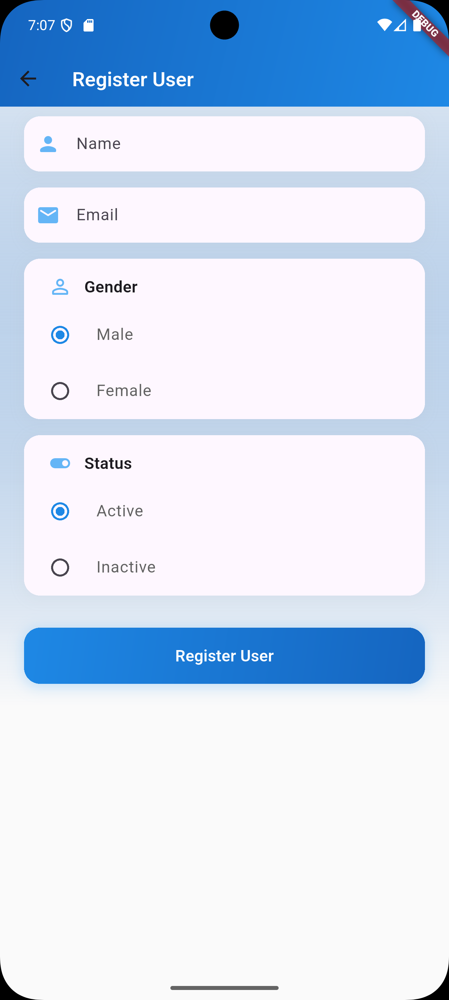
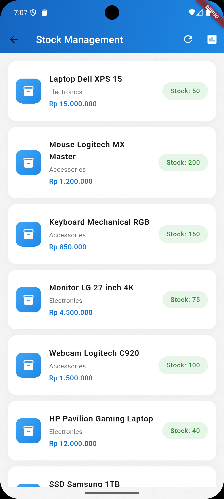
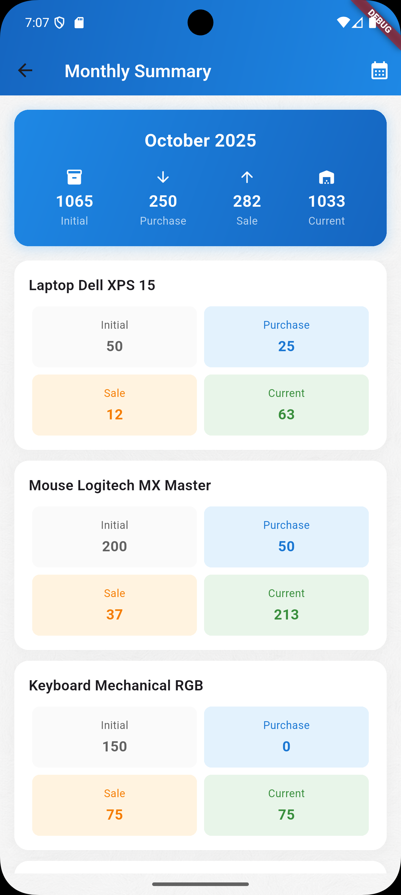
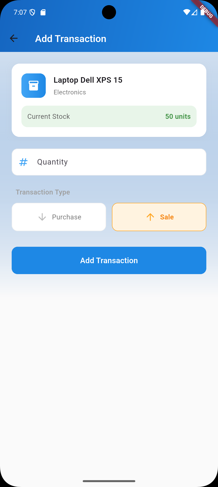
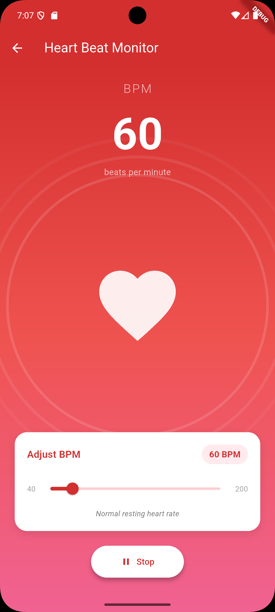

# 📱 Eratani - User Management & Stock Tracking App

A modern Flutter application featuring user management, stock inventory tracking, and heart rate monitoring with beautiful animations and Material Design 3.

[](https://flutter.dev)
[](https://dart.dev)
[](LICENSE)

## ✨ Features

### 👥 User Management

- **User List Display** - View all registered users with elegant card design
- **Search Functionality** - Search users by name or email in real-time
- **User Registration** - Add new users with name, email, gender, and status
- **Modern UI** - Material Design 3 with gradient headers and smooth animations
- **Pull to Refresh** - Refresh user data with swipe gesture

### 📦 Stock Management (Clean Architecture)

- **Product Inventory** - Track multiple products with categories
- **Stock Transactions** - Record purchase and sale transactions
- **Monthly Summary** - View detailed monthly stock reports
- **Real-time Calculations** - Automatic stock calculation (Initial + Purchase - Sale = Current)
- **JSON Data Storage** - Dummy data loaded from JSON assets
- **Category Management** - Organize products by Electronics, Accessories, Storage, Components

### ❤️ Heart Beat Monitor

- **Animated Heart Beat** - Realistic heart animation with double-thump effect
- **BPM Control** - Adjustable beats per minute (40-200 BPM)
- **Pulse Waves** - Beautiful pulse circle animations
- **Heart Rate Categories** - Displays health status based on BPM
  - < 60: Bradycardia (Slow heart rate)
  - 60-100: Normal resting heart rate
  - 101-140: Light to moderate activity
  - 141-180: Vigorous activity
  - \> 180: Maximum heart rate
- **Start/Stop Control** - Interactive animation control

## 📸 Screenshots

### User Management

 

### Stock Management

  

### Heart Beat Monitor



## 🏗️ Architecture

This project follows **Clean Architecture** principles with clear separation of concerns:

```
lib/
├── core/
│   └── routes/
│       └── routes.dart                 # Navigation routing
├── features/
│   ├── user/
│   │   ├── data/
│   │   │   ├── datasources/           # API data sources
│   │   │   ├── models/                # Data models
│   │   │   └── repositories/          # Repository implementations
│   │   ├── domain/
│   │   │   ├── entities/              # Business entities
│   │   │   └── repositories/          # Repository interfaces
│   │   └── presentation/
│   │       ├── cubit/                 # State management (BLoC)
│   │       └── pages/                 # UI pages
│   ├── stock/
│   │   ├── data/
│   │   │   ├── datasources/           # Local JSON data source
│   │   │   ├── models/                # Stock data models
│   │   │   └── repositories/          # Repository implementations
│   │   ├── domain/
│   │   │   ├── entities/              # Stock entities
│   │   │   └── repositories/          # Repository interfaces
│   │   └── presentation/
│   │       ├── cubit/                 # Stock state management
│   │       └── pages/                 # Stock UI pages
│   └── heartbeat/
│       └── presentation/
│           └── pages/                 # Heart beat animation page
└── assets/
    └── data/
        ├── products.json              # Product dummy data
        └── transactions.json          # Transaction dummy data
```

## 🛠️ Tech Stack

- **Flutter SDK**: 3.35.4
- **Dart**: 3.9.2
- **State Management**: flutter_bloc (Cubit)
- **Dependency Injection**: get_it
- **HTTP Client**: dio
- **Date Formatting**: intl
- **UUID Generation**: uuid
- **UI Loading**: shimmer

## 📦 Dependencies

```yaml
dependencies:
  flutter:
    sdk: flutter
  flutter_bloc: ^8.1.6
  dio: ^5.7.0
  get_it: ^7.7.0
  intl: ^0.19.0
  uuid: ^4.5.1
  shimmer: ^3.0.0

dev_dependencies:
  flutter_test:
    sdk: flutter
  flutter_lints: ^5.0.0
```

## 🚀 Getting Started

### Prerequisites

- Flutter SDK 3.35.4 or higher
- Dart 3.9.2 or higher
- Android Studio / VS Code with Flutter extensions
- Android SDK / iOS SDK (for mobile development)

### Installation

1. **Clone the repository**

   ```bash
   git clone https://github.com/igobhaktiar/user_management_app.git
   cd eratani
   ```

2. **Install dependencies**

   ```bash
   flutter pub get
   ```

3. **Run the app**
   ```bash
   flutter run
   ```

### Build for Production

**Android APK**

```bash
flutter build apk --release
```

**iOS IPA**

```bash
flutter build ios --release
```

**Web**

```bash
flutter build web --release
```

## 📱 Platform Support

| Platform | Support |
| -------- | ------- |
| Android  | ✅      |
| iOS      | ✅      |
| Web      | ✅      |
| Windows  | ✅      |
| macOS    | ✅      |
| Linux    | ✅      |

## 🎨 Design Features

- **Material Design 3** - Modern and consistent UI
- **Gradient Backgrounds** - Eye-catching color gradients
- **Smooth Animations** - 60fps animations with AnimationController
- **Responsive Layout** - Adapts to different screen sizes
- **Custom Shapes** - Rounded corners and shadows
- **Color-coded Categories** - Visual distinction for data types

## 📊 Data Structure

### Products JSON

```json
{
  "id": "1",
  "name": "Laptop Dell XPS 15",
  "category": "Electronics",
  "initialStock": 50,
  "price": 15000000
}
```

### Transactions JSON

```json
{
  "id": "uuid",
  "productId": "1",
  "productName": "Laptop Dell XPS 15",
  "quantity": 25,
  "date": "2025-10-01T08:00:00Z",
  "type": "purchase"
}
```

## 🔄 State Management

The app uses **BLoC (Cubit)** pattern for state management:

- **UserCubit** - Manages user list state
- **StockCubit** - Manages stock, transactions, and monthly summaries
- **Immutable States** - Predictable state changes
- **Event-driven** - Reactive UI updates

## 🧪 Testing

Run unit tests:

```bash
flutter test
```

Run integration tests:

```bash
flutter test integration_test
```

## 📝 License

This project is licensed under the MIT License - see the [LICENSE](LICENSE) file for details.

## 👨‍💻 Author

**Igo Bhaktiar**

- GitHub: [@igobhaktiar](https://github.com/igobhaktiar)

## 🤝 Contributing

Contributions, issues, and feature requests are welcome!

1. Fork the Project
2. Create your Feature Branch (`git checkout -b feature/AmazingFeature`)
3. Commit your Changes (`git commit -m 'Add some AmazingFeature'`)
4. Push to the Branch (`git push origin feature/AmazingFeature`)
5. Open a Pull Request

## 📧 Support

For support, email your-email@example.com or open an issue in the repository.

## 🙏 Acknowledgments

- Flutter Team for the amazing framework
- Material Design for design guidelines
- Community packages maintainers

---

Made with ❤️ using Flutter
